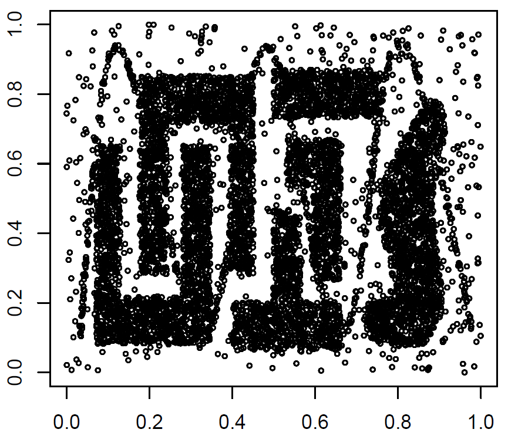
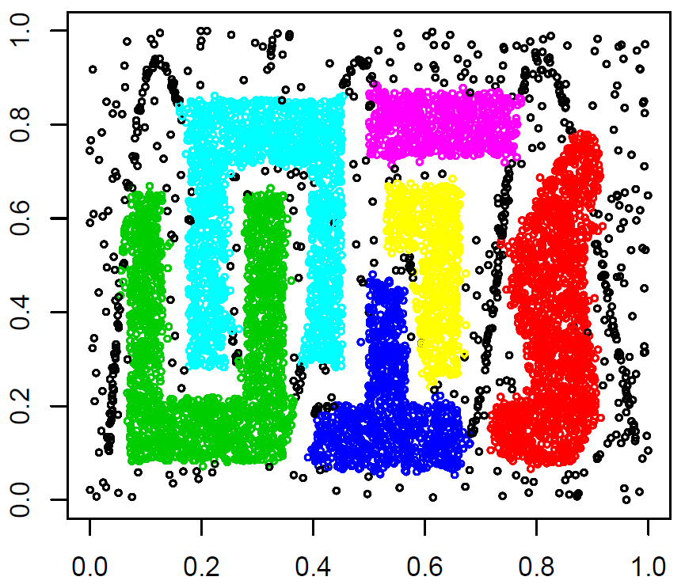

# RP-DBSCAN: A Superfast Parallel DBSCAN Algorithm Based on Random Partitioning
> __Publication__ </br>
> Song, H. and Lee, J., "RP-DBSCAN: A Superfast Parallel DBSCAN Algorithm Based on Random Partitioning," *In Proc. 2018 ACM Int'l Conf. on Management of Data (SIGMOD)*, Houston, Texas, June 2018. 

## *** Note ***
One comment to use RP-DBSCAN is that "do not use too small value as the epsilon parameter". If you set too small value, there is no benefit from cell-based random partitioning because each data point regards as a cell. This problem may degrade the performance of RP-DBSCAN by inducing a significant number of edges between cells. Thus, please carefully set the epsilone value. In my opinion, we don't need to set the epsilon value to be too small when handling large data set; it causes too many clusters to be obtained as the result.
Also, be careful to set the Spark configuration such as # worker, memory size, etc. Because RP-DBSCAN is distributed algorithm based on Spark, its performance is somewhat dependent on the configuration.

## 1. Overview
Following the recent trends in big data processing, several parallel DBSCAN algorithms have been reported in the literature. In most such algorithms, neighboring points are assigned to the same data partition for parallel processing to facilitate calculation of the density of the neighbors. This data partitioning scheme causes a few critical problems including load imbalance between data partitions, especially in a skewed data set. To remedy these problems, we propose a cell-based data partitioning scheme, pseudo random partitioning, that randomly distributes small cells rather than the points themselves. It achieves high load balance regardless of data skewness while retaining the data contiguity required for DBSCAN. In addition, we build and broadcast a highly compact summary of the entire data set, which we call a two-level cell dictionary, to supplement random partitions. Then, we develop a novel parallel DBSCAN algorithm, Random Partitioning-DBSCAN (shortly, RPDBSCAN), that uses pseudo random partitioning together with a two-level cell dictionary. The algorithm simultaneously finds the local clusters to each data partition and then merges these local clusters to obtain global clustering. To validate the merit of our approach, we implement RP-DBSCAN on Spark and conduct extensive experiments using various real-world data sets on 12 Microsoft Azure machines (48 cores). In RP-DBSCAN, data partitioning and cluster merging are very light, and clustering on each split is not dragged out by a specific worker. Therefore, the performance results show that RP-DBSCAN significantly outperforms the state-of-the-art algorithms by up to 180 times.

## 2. Algorithms
- DBSCAN [1] 
- SPARK-DBSCAN [2] 
- ESP-DBSCAN [3] 
- RBP-DBSCAN [4] 
- CBP-DBSCAN [2] 
- NG-DBSCAN [6] 
- __*RP-DBSCAN*__ : Spark implementation of our algorithm

>__*Reference*__</br>
[1] Martin Ester, Hans-Peter Kriegel, J¨org Sander, and Xiaowei Xu. 1996. A Density-Based Algorithm for Discovering Clusters in Large Spatial Databases with Noise. *In Proc. 2nd Int’l Conf. on Knowledge Discovery and Data Mining*. 226–231.</br>
[2] Yaobin He, Haoyu Tan, Wuman Luo, Shengzhong Feng, and Jianping Fan. 2014. MR-DBSCAN: A Scalable MapReduce-based DBSCAN Algorithm for Heavily Skewed Data. *Frontiers of Computer Science* 8, 1 (2014), 83–99.</br>
[3] Irving Cordova and Teng-Sheng Moh. 2015. DBSCAN on Resilient Distributed Datasets. *In Proc. 2015 Int’l Conf. on High Performance Computing & Simulation*. 531–540.</br>
[4] Bi-Ru Dai and I-Chang Lin. 2012. Efficient Map/Reduce-Based DBSCAN Algorithm with Optimized Data Partition. *In Proc. 2012 IEEE Int’l Conf. on Cloud Computing*. 59–66.</br>
[5] Alessandro Lulli, Matteo Dell’Amico, Pietro Michiardi, and Laura Ricci. 2016. NG-DBSCAN: Scalable Density-Based Clustering for Arbitrary Data. *Proceedings of the VLDB Endowment* 10, 3 (2016), 157–168.

## 3. Data Sets
| Name           | # Object       | # Dim    | Size    | Type  |  Link   |
| :------------: | :------------: | :------: |:-------:|:-----:|:-------:|
| GeoLife        | 24,876,978     | 3        | 808 MB  | float | [link](http://www.microsoft.com/en-us/download/) |
| Cosmo50        | 315,086,245    | 3        | 11.2 GB | float | [link](http://nuage.cs.washington.edu/benchmark/astro-nbody/) |
| OpenStreetMap  | 2,770,238,904  | 2        | 77.1 GB | float | [link](http://blog.openstreetmap.org/2012/04/01/bulk-gps-point-data/) |
| TeraClickLog   | 4,373,472,329  | 13       | 362 GB  | float | [link](http://labs.criteo.com/downloads/download-terabyte-click-logs/) |

## 4. Configuration
 - We conducted experiments on 12 Microsoft Azure D12v2 instances loacted in South Korea. 
 - Each instance has four cores, 28GB of main memory, and 200GB of disk (SSD). 
 - All instances run on Ubuntu 16.04.3 LTS. We used Spark 2.1.0 for distributed parallel processing. 
 - Ten out of 12 instances were used as worker nodes, and the remaining two instances were used as master nodes. 
 - RP-DBSCAN algorithm was written in the Java programming language and run on JDK 1.8.0_131.

## 5. How to run
- Compile
  - Download the spark library from [Apache Spark](http://spark.apache.org/downloads.html).
  - Add the spark library to your java project with the source code in [RP_DBSCAN](RP_DBSCAN) folder.
  - Make a _jar file_ using IDE tools. For example, you can easily make it using Eclipse through *project name->export->jar file*. It is possible that you just download the jar file in [Jar](Jar) folder.
- Create _Azure HDInsight_ instances
  - Refer to [HDInsight Document](https://docs.microsoft.com/en-us/azure/hdinsight/).
- Move the data sets into the _HDFS_
  - Download all data sets from the above links and move them to the _Azure master node_.
  - Transfer your data sets from the _Azure master node_ into _HDFS_.</br>
   ```
    hdfs dfs -put localPathForInputData hdfsPathForInputData
   ```
- Run **RP-DBSCAN** algorithm
  - Necessary algorithm parameters
   ```
    -i : the hdfs file/dir path for input data set.
    -o : the local file path to write the meta result of clustering (e.g., # of (sub-)cells, # of points for each cluster).
    -np : the total number of cpu cores or partitions which you want to set.
    -rho : the approximation parameter
    -dim : the number of dimensions.
    -minPts : the minimum number of neighbor points.
    -eps : the radius of a neighborhood.
   ```
  - Optional algorithm parameters
   ```
    -bs : the block size for virtually combining two-level cell dictionary (default : 1).");
    -l : the hdfs dir path to write labeled points, <point id, cluster label>, (default : no output).");
   ```  
  - Execution commend
   ```
    spark-submit --class mainClass jarFile -i hdfsInputPath -o localOutputPath -np numOfPartitions -rho rhoValue -dim numOfDimensions -eps epsilonValue -minPts minPtsValue
   ```
 
## 6. Tutorial
- Synthetic data set (in [DataSet](Example/DataSet) folder)

 | Name           | # Object       | # Dim    | Size    | Type  | 
 | :------------: | :------------: | :------: |:-------:|:-----:|
 | Chameleon      | 100,000        | 2        | 2.67 MB | float | 

 

- Spark parameter tunning in [MainDriver.java](RP_DBSCAN/src/dm/kaist/main/MainDriver.java)

 ```
 // You should set proper spark configurations considering your distributed processing environment.
 // e.g., the number of instances = 5
 //       the number of cores in each executor = 4
 //       the size of executor memory = 20g
 //       the size of driver memory = 10g
 //       the size of heap memory = 2g
 
 (line 39) SparkConf sparkConf = Conf.setSparkConfiguration("5", "4", "20g", "10g", "2048");
 ```

- Commends

```
 // Move chameleon data set from local disk into HDFS.
 hdfs dfs -put chameleon.ds /chameleon.ds
 
 // Run RP-DBSCAN on chameleon data set (without writing labeled points).
 spark-submit --class dm.kaist.main.MainDriver RP_DBSCAN.jar -i addressOfHDFS/chameleon.ds -o output.txt -np 20 -rho 0.01 -dim 2 -eps 0.02 -minPts 180
 
 // Run RP-DBSCAN on chameleon data set (with writing labeled points).
 // labeled points are written in HDFS
 // When data size is extremly large, this writing can take a long time.
 spark-submit --class dm.kaist.main.MainDriver RP_DBSCAN.jar -i addressOfHDFS/chameleon.ds -o output.txt -np 20 -rho 0.01 -dim 2 -eps 0.02 -minPts 180 -l labeledOutput
 
 // Get labeledOutput directory from HDFS into current directory
 hdfs dfs -get labeledOutput .
```
 
- Example of output.txt

```
-i : wasb://dmcluster@dmclusterstorage.blob.core.windows.net/chameleon.ds
-o : output.txt
-np : 20
-rho : 0.01
-dim : 2
-eps : 0.02
-minPts : 180
-bs : 1
-l : labeledOutput 

The number of cells : 2684
The number of sub-cells : 73020
The number of sub-dictionaries : 1
The number of core points : 85894

The number of clusters : 6
Cluster 1 : 19956
Cluster 2 : 22621
Cluster 3 : 12103
Cluster 4 : 20795
Cluster 5 : 8189
Cluster 6 : 8203

Total elapsed time : 18.127s
 
```
 
- Example of a file in labeledOutput directory
 
```
Pid Label
15169 5
20272 5
59512 5
96722 1
74315 1
...

```

- Plotting of the clustering result
  - The source code for generating _R_input.txt_ to plot the clustering result is in [Plotting](Plotting) folder.
  - plotting commend using R.
  
  ```
  result <- read.table("C:/R_input.txt", sep=" ")
  plot(result$V2,result$V3, col=result$V4, cex = 0.5)
  ```
  
   
